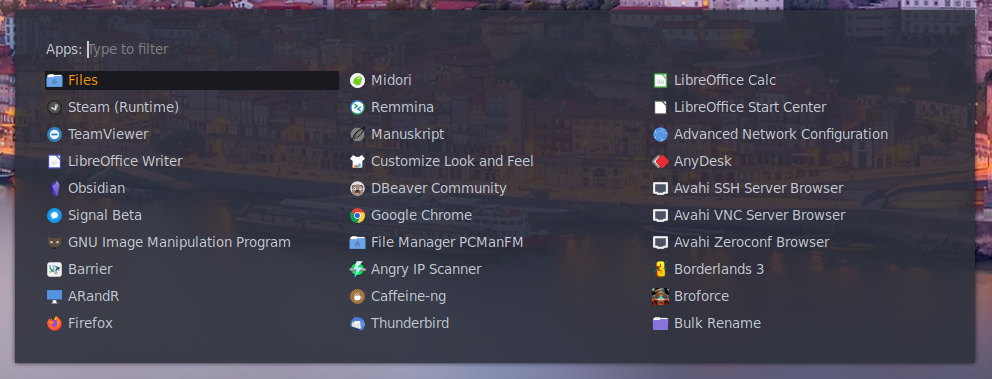
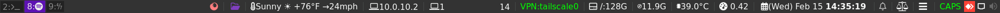
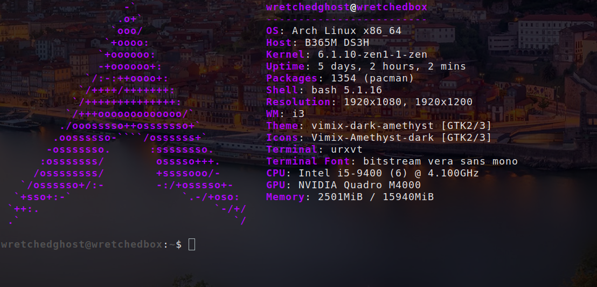
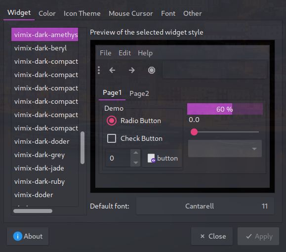
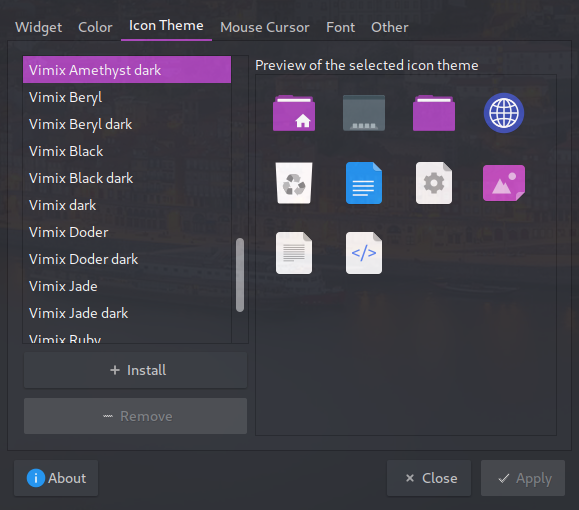

# My i3 Setup

What we have here is my latest i3 config for my workstation. My theme is based on three colors. Purple, white, and grey. 

## Home Screen

Here are some pictures of my screen using scrot. The wallpapers are of one my favorite places in the world: Porto, Portugal. Don't mind the gap on the left screen. That is due to my left screen being a 1920x1080 (16:9) while my right screen is a 1920x1200 (16:10).

## Rofi

## i3Blocks

I obsfucated my public IP, even though its my tailscale public IP, for obvious reasons.

My bar shows icons, workspace number, the weather, when VPNs are connected, private IP address, space left in `/`, RAM, CPU usage and temp, a date that you can click on which opens a dropdown menu calendar, the ability to control the CPU speeds (this is meant for laptops), etc.

## urxvt Terminal

I have customized `neofetch` to show the arch logo and the titles in a custom purple color. It took me a good while to find the color I was looking for. 

## Theme

## Color Chooser

The site I used to find the colors I was looking for.

[https://htmlcolorcodes.com/colors/](https://htmlcolorcodes.com/colors/)

## Prerequisites and recomendations

* Arch (This config might work with other distros but I haven't tested it anything other than Arch)
* i3-wm (The new upstream i3 as i3-gaps was merged with i3-wm **FINALLY**!)
* i3blocks (Top Menu Bar)
  * NetworkManager (Needed for nm-vpn Blocket)
  * networkmanager-openvpn
  * perl-json (Needed for weather_NOAA Blocklet)
  * tailscale
* vim (My personal favorite text editor)
* feh (A simple but effective photo viewer and wallpaper setter)
* urxvt-perls (Also my personal favorite terminal emulator once its been configured. Otherwise urxvt is ugly as crap)
* firefox (I swapped from Brave to Firefox due to Chrome and Chrome-clones security/privacy concerns. And especially with Chrome's eventual move to web 3.0)
* rofi (Program/app menu. Replaces dmenu as it is better looking and more configurable) 
* dunst (Notification pop-up program) 
* scrot (For taking screenshots)
* neofetch (Shows hardware and flashy info in the terminal)
* ttf-font-awesome (For all the cool image logos)
* ttf-dejavu (My standard font for everything else)
* ttf-monoid (A great font for the terminal)
* gsimplecal (Simple GUI calendar)
* galculator (Gnome calculator)
* conky (It is designed to show clock and date on main screen in my config)
* picom (Window transperancy and window shadow. A must need for your windows to look extra cool)
* redshift (Sets color screen and can be set on a schedule. Usually only for laptops but can work well on a desktop if you are a night-owl like myself and don't like your eyes to burn with bright white windows)
* thunar or pcmanfm (Both are good file managers. pcmanfm is lighter weight but thunar has some pretty cool options, bulk-rename, etc.)
* voluemicon (Tray volume icon)
* networkmanager-applet (Tray networkmanager icon)

### Laptop

* acpi (Only needed if you have a laptop)

## Step to make your setup to look like mine

1. Install `lightdm` and `lightdm-slick-greeter`
2. Place `background.jpg` in `/usr/share/pixmaps/`. You will need superuser access to do this.
3. Copy the `lightdm` folder into `/etc/lightdm/`. Again you will need superuser access. 
4. Copy `.Xresources`, `.bashrc`, `.fehbg`, `.tmux.conf`, `.config`, `Pictures`, and `.xinitrc` into your home directory.
5. Run `$ source ~/.bashrc` in command-line.

1. Copy-in-place `libreoffice-writer.desk` into `~/.local/share/applications/libreoffice-writer.desktop`

## To-Be-Fixed

1. Not really a fix but I am looking at building a script that will install my setup just how I like it. As for right now I have an automated script I built that will install arch-linux using `ext4`, `LUKS2`, `swapfile`, and a `tmpfs`. Check it out here: [https://github.com/wretchedghost/easy-arch-ext4](https://github.com/wretchedghost/easy-arch-ext4)
